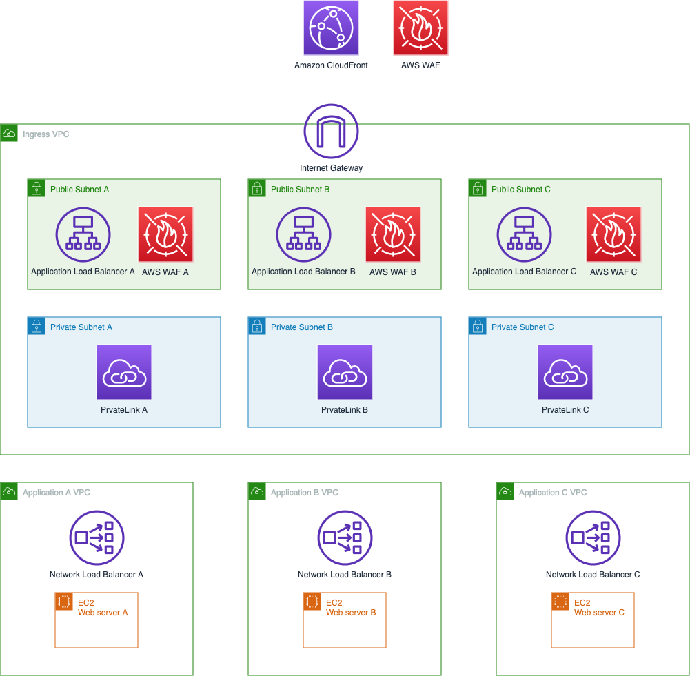
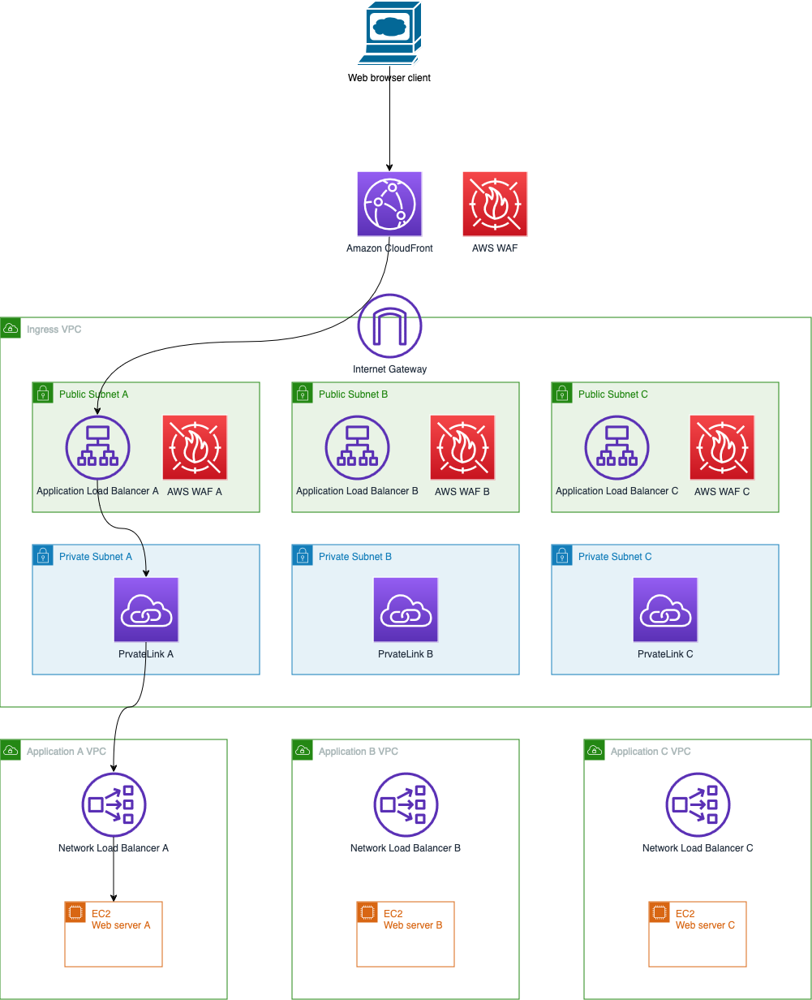

# Shared Internet Ingress on AWS
## Introduction
First up, let me say that I am highly opinionated on this topic. I have had dozens (if not hundreds) of conversations with customers about this over the years.

My strong belief is that customers should not have a shared ingress point. The reasons for wanting them are quite common:
1. "This is how we did it on premises" - a totally valid claim but in the on premises world there were generally very few (one or two) network links into the customer network from the internet. So it made sense to have shared ingress for everyone b ecause there was (after all) a shared network link where the traffic was delivered. In AWS this is no longer true - from the perspective of customer VPCs the Internet is "just there" and there is more bandwidth available than is practical for a customer to consume.
2. "I want to inspect everything" which tends to come from security and compliance teams. This is a valid requirement but feeding all traffic through a shared firewall (again, as was done on premises) or firewall cluster means that the firewall(s) become a big central point of failure. If one application is having a good day (i.e. higher levels of traffic than usual) then every other application relying on those firewalls may be having a bad day. If one application is having a bad day (i.e. under DDoS) then everyone is having a bad day.
3. "Distributed ingress scares me" because the level of cloud maturity and the use of automation witin the customer's team is not at a level where they can effectively administer, monitor and control multiple ingress points. This is a completely valid point and it is why this repo exists.

 The other reason I am not a fan of ahared ingress is linked to (1) and sometimes (2) - because firewalls are not always in the mix here - and that is that bringing all traffic into a single point introduces a large administrative blast radius. If a user has a bad day and accidentally makes the wrong change they can affect a lot of applications even if that change is not malicious.
 
 And in the AWS world, all accounts comes with limits of some sort. If there are dozens, hundreds or thousands of applications relying on a single ingress point then the likelihood of running into some sort of API limit on the AWS side is high. Splitting the applications up is a wise move.

This repo is a middle ground - it delivers a design compromise where there is some level of shared ingress and centralised control; but it distributes the application traffic in a way that is scalable both in terms of AWS accounts and the ability to give responsibility for each application to different teams.

I still believe that distributed ingress is more scalable and a better solution overall - customers often tell me that they can see the benefits but they cannot make the leap to get there in the short term.

I can't take credit for the original idea - it comes from [an AWS blog post](https://aws.amazon.com/blogs/networking-and-content-delivery/how-to-securely-publish-internet-applications-at-scale-using-application-load-balancer-and-aws-privatelink/) by Tom Adamski so do go and check that out.
## Solution Components
- [Amazon Virtual Private Cloud](https://aws.amazon.com/vpc/) (VPC)
- [Application Load Balancer](https://aws.amazon.com/elasticloadbalancing/application-load-balancer/) (ALB)
- [Network Load Balancer](https://aws.amazon.com/elasticloadbalancing/network-load-balancer/) (NLB)
- [AWS Web Applicatin Firewall](https://aws.amazon.com/waf/) (WAF)
- [Amazon CloudFront](https://aws.amazon.com/cloudfront/)
- [AWS PrivateLink](https://aws.amazon.com/privatelink/)
## Network Diagram

This diagram only shows a single Availability Zone to make it simpler too look at. However, I strongly encourage you to operate in multiple AZs for the obvious reason of redundancy. This will increase costs because PrivateLink charges for attachments on a per-AZ basis.
## Traffic Flow

## CloudFormation Templates
There are four CloudFormation templates - deploy them in the following order:
1. [Ingress VPC](cfn-ingress-vpc.yaml)
2. [Application VPC](cfn-application-vpc.yaml)
3. [Applicationn ingress configuration](cfn-ingress-application.yaml)
4. [Application workload](cfn-application-workload.yaml)
None of the templates allow you to choose the IP address range being used; while I could do that and get CloudFormation to divvy up the address space it adds complexity to the template that isn't needed from a demonstration perspective. As it is, the IP ranges chosen are more than is required - if you are short on IP address space then consider using only the moinimum that you require.
### Ingress VPC Template
This template creates the ingress VPC and Internet Gateway along with two public subnets and two private subnets with appropriate route tables.

Deploy this template only once - it is used by all applications.
### Application VPC Template
This template creates the application VPC, a NLB for distributing traffic to the workload and creates the PrivateLink endpoint service that will be shared with the ingress VPC.

** TODO **: How much of the sharing/accepting can we automate without having to use a custom resource? Update comments here once that is done.

Deploy this template once per application. It would normally be deployed in a separate account to the ingress VPC but it will work equally well in the same account (see the FAQ below).
### Application Ingress Configuration Template
This templates creates the ALB for the application; creates and assigns a security group to the ALB; sets up a CloudFront distribution with an origin pointing to the ALB; secures the connection to the ALB by using a prefix group and a custom header [as per the documentation](https://docs.aws.amazon.com/AmazonCloudFront/latest/DeveloperGuide/restrict-access-to-load-balancer.html).

** TODO **: How does the ALB know about the IP targets that PrivateLink presents? Do we use the PL identifier for a lookup?

You will need to specify the VPC id of the ingress VPC and select the public subnets that were created in the previous step. You will also need to name the application. This isn't particularly important except that the name is used as a key to ensure that CloudFront and ALB communicate securely. The application name will also be used in the tags.

Deploy this template once per application. It is deployed in the same account and region as the Ingress VPC Template.
### Application Workload Template
This template is separate because in a production environment you are probably going to have some other workload. You might even combin the application VPC and workload templates.

The template deploys an auto-scaling group of two web servers running on t3.nano instances spread across two availability zones. Instead of EC2 you might use containers with [Amazon Elastic Container Service](https://aws.amazon.com/ecs/), [Amazon Elastic Kubernetes Service](https://aws.amazon.com/eks/) or [AWS Fargate](https://aws.amazon.com/fargate/).

You will need to specify the NLB ARN that was deployed using the Application VPC template so that the auto-scaling group can register the web servers as targets.

Deploy this template once per application.
### Notes
The CloudFormation templates deploy resources into two Availability Zones. When operating in multiple accounts (and therefore creating subnets in different VPCs in those accounts), make sure that you are using the same Availability Zones by ccross-referencing the Availability Zone identifiers. You can see these by looking at the subnet details in the AWS console or by using the AWS CLI and running `aws ec2 describe-availability-zones`.

While the WAF components for the ALB are shown in the diagram as being "beside" the ALBs, in reality they are deployed "on" each ALB.

This template only deploys a HTTP endpoint but the design fully supports (and I strongly recommend) that you use HTTPS because encryption is a good (and should be mandatory!) thing. You can incorporate HTTPS into the CloudFormation template - I have not done so in this case because it requires you to confirm ownership of domains which is not practical as a demonstration.

HTTPS connections require valid certificates. In a production environment you would be using your own domain name and so you should use [AWS Certificate Manager](https://aws.amazon.com/certificate-manager/) to deploy certificates for CloudFront and ALB because it is free and it will automatically rotate your certificates for you.

Given that there will be multiple WAF instances deployed (one for each ALB and one for CloudFront) you should also consider using [AWS Firewall Manager](https://aws.amazon.com/firewall-manager/) to centrally manage the rules.
## Frequently Asked Questions
### Why is PrivateLink being used?
PrivateLink is providing two benefits:
1. It allows for the application VPCs to have IP addresses that overlap with each other and/or the ingress VPC. In most environments this will not be the case and I'd advise that you shouldn't do this in any case as it will generally make your life harder if you do. I'm also opinionated about this and you should [generally avoid deliberately creating networks with IP overlap if you can](https://aws.amazon.com/blogs/networking-and-content-delivery/connecting-networks-with-overlapping-ip-ranges/).
2. Access to applications can only be initiated from the ingress VPC to the application VPCs. The application VPCs cannot use the ingress VPC as an egress path. To put it another way, the applications cannot initiate traffic to the internet throught the ingress VPC.

Of these two things, (2) is probably the most relevant although PrivateLink is not the only way to deliver traffic to the applications. You might use Transit Gateway...
### Can I use Transit Gateway instead of PrivateLink?
Yes. You can link all the VPCs together using Transit Gateway. On the application ALB in the ingress VPC you would use the private IP addresses of the NLB in the application VPC as IP targets. Note that if you intend on having the IP address ranges of the application VPCs overlap you must use PrivateLink. In most customer environments this is not the case.

Using Transit Gateway instead of PrivateLink means that you could use the ingress VPC as an egress VPC as well. This might be desirable. Or not.
### How do applications reach the internet?
When application instances initiate connections out of their VPC the traffic will use the routes specified in that VPC. Normally, the VPC will be connected to a Transit Gateway so that it can communicate with other VPCs in your environment. Presumably, that Transit Gateway will have some way of allowing VPCs that are attached to it to access the internet.

[Here's a blog post](https://aws.amazon.com/blogs/networking-and-content-delivery/creating-a-single-internet-exit-point-from-multiple-vpcs-using-aws-transit-gateway/) describing how to set up a single internet exit point using Transit Gateway.
### Does this work across multiple accounts?
Yes. The intention is that the network or security team will control the ingress VPC; but the application teams each have their own separate VPCs. Those VPCs can (and should be!) in different accounts. Using different accounts greatly simplifies permissions; eestablishes firm boundaries around each application (in terms of security and billing); reduces administrative blast radius; and allows each application to operate independently in terms of AWS account limits.
### Is using multiple accounts mandatory?
No, this solution works equally well in a single account but it makes more sense to use multiple accounts to maintain administrative separation as per the question/answer above. If you were running in a single account you might as well run all the resources in a single VPC which would be a lot less expensive. But then it is avoiding the point of this exercise which is to have separation of administrative duties.
### Can I inspect the ingress traffic with my firewall?
Yes, you can. But you should think carefully before doing this. It can lead to the situation where the firewalls are a single shared point of failure for all of the applications.

If you do wish to inspect all traffic, you can use [Gateway Load Balancer](https://aws.amazon.com/elasticloadbalancing/gateway-load-balancer/) to send traffic to the firewall of your choice or use [AWS Network Firewall](https://aws.amazon.com/network-firewall/). You can see how to do this in the [launch blog post](https://aws.amazon.com/blogs/networking-and-content-delivery/introducing-aws-gateway-load-balancer-supported-architecture-patterns/) for Gateway Load Balancer - the patterns for Network Firewall are the same.

You can choose to inspect the traffic betore it is delivered to the ALBs (using an ingress route table); or you can inspect in beteen the ALBs and the PrivateLink endpoints (by adding an inspection subnet and routing traffic to the Gateway Load Balancer/Network Firewall endpoint in that subnet).

If you must do this (and I'm not encouraging this design modification) I would recommend inspecting between the ALBs and the PrivateLink endpoints as you can use ALB and WAF (as well as CloudFront and WAF) to get rid of unwanted traffic in less expensive and scalable way, leaving only "interesting" traffic for the firewalls to inspect. The less traffic to inspect, the less expensive it will be to inspect that traffic.